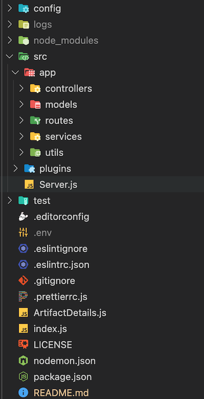

<h4 align="center">Fastify Server developed with Nodejs.</h4>

<p align="center">
    <a href="https://github.com/flembee/fastify-server/tree/main">
    
    <a href="https://github.com/flembee/fastify-server/tree/develop">
    
</p>
      
<p align="center">
  <a href="#about">About</a> •
  <a href="#structure">Project Structure</a> •
  <a href="#installation">Installation</a> •
  <a href="#deploy">Deploy</a> •
  <a href="#features">Features</a> •
  <a href="#author">Author</a> •
  <a href="#support">Support</a> •
  <a href="#contribute">Contribute</a> •
  <a href="#license">License</a>
</p>

---

## About

<table>
<tr>
<td>
  
This project is a small server using NodeJs and Fastify. It aims to show all the Fastify basics, best practices and recommendations. In addition, the Fastify MongoDB connection is complemented, with Mongoose, by means of a Fastify plugin **[Info Here](https://www.fastify.io/docs/latest/Reference/Plugins/)** On the other hand, the connection to an SQL instance (MySQL, SQL Server or PostgreSQL) using Sequelize to create and manage the database tables.

The user logins via Auth, the application is also protected by a rate limiter and during development it exposes a Swagger UI with every endpoint. Read the next section to understand how the project works and how it is recommended to explore it.

</td>
</tr>
</table>

## Project Structure

<table>
<tr>
<td>
  
The project follows a well established pattern within the Fastify community, it has two top level folders, `app` and `plugins`.

<p style="text-align:center">
  
</p>

The first one contains all the code that should be shared across your entire aplication, such as controllers, services, models and routes, while the second one contains all the plugins, such as the redirect code and the auth APIs (Authentication), Database connection, Storage manager in the GCP and ReadPDF service.

We recommend to follow this pattern, you can generate a project with the Flembee structure or by using [fastify-cli](https://github.com/fastify/fastify-cli).

</td>
</tr>
</table>

## Installation

##### Downloading and installing steps:
* **[Download or Clone](https://github.com/flembee/fastify-server.git)** the latest version of the Code.

1. Create an `.env` file from the template:

#### MongoDB

    ```console
        PORT=3000
        MONGO_URL=
        SERVER_PORT=3050
        SECRET_KEY=
        EXPIRES_IN=6h
        RESET_EXPIRES_IN=300000
        RESET_SECRET_KEY=
        salt=13
        GCP_PROJECT_ID=
        GCP_SERVICE_ACCOUNT=
        GCP_PRIVATE_KEY=
        GCP_STORAGE_BUCKET=
    ```

#### SQL

    ```console
        PORT=3000
        SQL_HOST=
        SQL_DB=
        SQL_USER=
        SQL_PASSWORD=
        SQL_DIALECT=
        SERVER_PORT=3050
        SECRET_KEY=
        EXPIRES_IN=6h
        RESET_EXPIRES_IN=300000
        RESET_SECRET_KEY=
        salt=13
        GCP_PROJECT_ID=
        GCP_SERVICE_ACCOUNT=
        GCP_PRIVATE_KEY=
        GCP_STORAGE_BUCKET=
    ```

2. Install dependencies:

```console
$ cd fastify-server/mongodb or fastify-server/sql
$ npm install
$ npm run dev
```

Now you can either run the project locally or deploy it.

 **Magic!!** it will automatically start the local server for backend and frontend. 
 > *Default App port is 3000 and Server port is 3050*

 ## Deploy

This section contains instructions for deploying this application.

Would you like to see more recipes? Open an [issue](https://github.com/flembee/fastify-server/issues/new).
Do you already have a deploy recipe and want to share it? That's awesome, send a [pull request](https://github.com/flembee/fastify-server/compare)!

#### Cloud  Run

Open [`deploy-cloud`](./deploy-cloud), you will find everything you need there.

## Features

| All the features|
| :------------- | 
| Login with authorization|
| REST API|
| MongoDB and SQL support |
| HTTP Requests|
| GCP Storage|
| Read PDF service|

 ### Also using TypeScript?

Yes! Fastify supports TypeScript [out of the box](https://www.fastify.io/docs/latest/TypeScript/)!
The project is written in plain JavaScript, but probably in the future there will be a branch with a TypeScript implementation.

## Author

| [](https://www.flembee.com) 	|
|:---------------------------------------------------------------------------------------------------------:	|
|                                            **Flembee**                                            	|

## Support

Contact us at one of the following ways:

- Website at https://www.flembee.com
- Github at **[flembee](https://github.com/flembee)**
- E-Mail: **flembee.technologies@gmail.com**

## Contribute

Feel free to send pull request with new features, bugfix or documentation improvements!

## License

[](https://github.com/flembee/basic-form/blob/main/LICENSE)

- Copyright © [Flembee](https://www.flembee.com).
